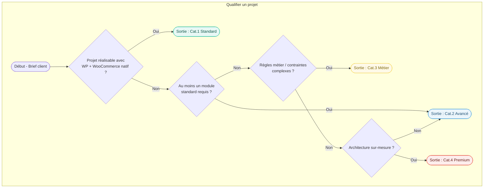

# 🔀 Flux décisionnel — Qualification des projets

> 🔒 **Document interne**
>
> Ce document sert de **référentiel décisionnel unique** pour qualifier
> un projet, déterminer sa catégorie réelle, appliquer les règles de
> requalification et identifier la maintenance applicable.
>
> Aucune interprétation commerciale ne doit primer sur ce flux.

---

## 🎯 Objectif du document

Ce flux décisionnel permet de :

- qualifier un projet de manière **factuelle**
- éviter les dérives de périmètre
- harmoniser les décisions entre agence et partenaire technique
- garantir la cohérence avec la grille de catégories, les modules et la maintenance

---

## 🔒 Règles d’usage

- Ce document est **strictement interne**
- Il s’applique **avant devis**, **avant vente**, et **avant engagement**
- Toute décision doit pouvoir être **justifiée par une règle ci-dessous**
- En cas de doute → **requalification vers la catégorie supérieure**

---

## 1️⃣ Point d’entrée — Type de site demandé

Le flux commence toujours par l’identification du **type de site de base** :

- Blog
- Site vitrine
- WooCommerce simple
- WooCommerce avancé
- Architecture headless / sur mesure

👉 Ce choix détermine une **catégorie initiale**, jamais définitive.

---

## 2️⃣ Catégorie initiale par défaut

| Type de site          | Catégorie initiale |
| --------------------- | ------------------ |
| Blog                  | Cat.1              |
| Site vitrine          | Cat.1              |
| WooCommerce simple    | Cat.1              |
| WooCommerce avancé    | Cat.2              |
| Headless / sur mesure | Cat.4              |

⚠️ Cette catégorie est **provisoire** et peut évoluer selon les modules.

---

## 3️⃣ Analyse des modules activés

Une fois le site de base identifié, il faut analyser les **modules activés**.

### 🟢 Modules neutres

Ces modules **n’entraînent pas automatiquement de requalification** :

- SEO standard
- Sécurité standard (socle technique)
- Performance standard
- Blog simple
- Compte client basique
- Dark mode
- Accessibilité de base

👉 Ils restent compatibles avec la catégorie initiale.

---

### 🔴 Modules structurants

Ces modules peuvent **modifier la catégorie du projet** :

- Multi-langue
- Multi-devises
- Tunnel de vente / conversion avancé
- Recherche & filtres avancés
- Marketing & tracking avancé
- Accises / fiscalité réglementée
- Tarification métier
- Connecteurs externes
- Dashboard personnalisé
- IA (assistant intelligent)
- Performance avancée
- Architecture headless

👉 Chaque module structurant déclenche une **vérification obligatoire**.

---

## 4️⃣ Règles de requalification

Les règles suivantes sont **non négociables** :

### Requalification automatique

- Multi-langue → **Cat.2 minimum**
- Multi-langue global (site entier) → **Cat.3**
- Accises / réglementation → **Cat.3 obligatoire**
- Tarification métier → **Cat.3**
- Connecteurs métier → **Cat.3**
- IA avec logique métier → **Cat.3**
- Headless → **Cat.4**

---

### Règle cumulative

- Si **un seul module** impose une catégorie supérieure → le projet est requalifié
- La **catégorie finale** est toujours la **plus élevée atteinte**

---

## 5️⃣ Détermination de la catégorie finale

La catégorie finale est définie par :

1. le type de site
2. les modules activés
3. les règles de requalification

👉 Cette catégorie finale sert de référence pour :

- le périmètre
- la complexité
- la maintenance
- la responsabilité technique

---

## 6️⃣ Détermination de la maintenance

Règles applicables :

- **Une seule maintenance active par site**
- La maintenance est **alignée sur la catégorie finale**
- Les modules **ne cumulent pas de maintenance**
- Les abonnements spécifiques (IA, emailing) sont traités à part

---

## 7️⃣ Abonnements externes

Certains modules impliquent des **coûts externes récurrents** :

- Assistant IA → abonnement dédié
- Emailing / newsletter → abonnement possible
- APIs tierces → selon fournisseur

👉 Ces abonnements sont :

- **distincts de la maintenance**
- explicitement mentionnés
- facturés séparément si nécessaire

---

## 8️⃣ Cas fréquents à risque

### Client se pense Cat.1 mais ne l’est pas

Exemples :

- demande multi-langue
- tunnel de conversion avancé
- contraintes réglementaires

👉 Obligation de **requalification immédiate**.

---

### Ajout de module en cours de vie

- analyse du module
- application des règles
- possible changement de catégorie
- ajustement de la maintenance

---

### Retrait de module

- possible baisse de catégorie
- **uniquement après validation technique**
- jamais automatique

---

## 9️⃣ Règles non négociables

- Catégorie 1 = simplicité réelle
- Toute complexité structurelle = requalification
- Aucun module ne “passe en douce”
- Le flux décisionnel prime sur le discours commercial

---

---

## 📌 Règle finale

> Ce flux est un **outil de protection** pour l’agence, le partenaire
> et le client.
>
> Toute demande hors cadre déclenche une **requalification**
> ou un **devis spécifique**, sans exception.
