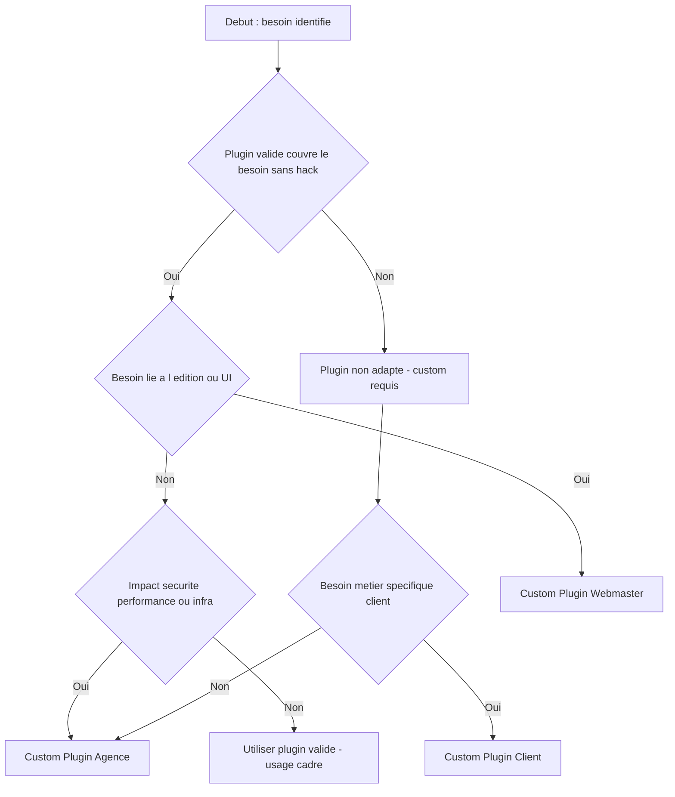

# 🔁 Flux décisionnel — Plugin validé vs Custom & Placement (Agence / Client / Webmaster)

📘 Ce flux s’applique **uniquement après validation** du socle technique
et du document `stack-refus.md`.

Ce document sert à décider, pour **chaque besoin fonctionnel**, s’il faut :

- utiliser un **plugin validé** (gratuit, remplaçable, sans lock-in)
- développer un **module custom**
- et surtout **où le placer** :
  - **Plugin Agence** (socle + modules réutilisables)
  - **Plugin Client** (métier / règles spécifiques au client)
  - **Plugin Webmaster** (édition, UI, contenu, réglages “safe”)

⚠️ Ce flux **ne sert pas** à qualifier la catégorie du projet (Cat.1 → Cat.4)
ni à contourner les exclusions définies dans `stack-refus.md`.

---

## ✅ Règles de base (à lire avant le diagramme)

1. **On part toujours du besoin**, pas d’un plugin.
2. **Un plugin n’est utilisable** que s’il est :
   - listé ou compatible avec la **white-list**
   - gratuit et utilisable en production
   - sans pression commerciale bloquante
   - **suffisant sans hacks**
3. **Le client et le webmaster n’ont jamais accès** à la configuration “Agence”.
4. Si le besoin touche à la **sécurité / performance / infrastructure** → c’est **Agence**
   (plugin validé possible, mais pilotage et abstraction côté Agence).

---

## 🗺️ Diagramme — Décider Plugin validé vs Custom & Placement

---

## 🧠 Interprétation rapide des sorties

### ✅ Utiliser un plugin validé

À choisir si :

- le plugin couvre **100% du besoin défini**
- pas besoin de hacks / overrides fragiles
- le paramétrage peut rester simple et documenté

📌 Rappel : si le besoin touche à la sécurité, la performance
ou l’infrastructure, le plugin validé doit être encapsulé
via un module ou un adaptateur **Agence**.

### 🧰 Custom → Plugin Agence

À choisir si :

- c’est réutilisable sur plusieurs projets
- c’est technique (sécurité, perf, architecture, modules standard)
- c’est une brique “cadre” (activation, logs, adaptateurs)

### 🪪 Custom → Plugin Client

À choisir si :

- le besoin est **métier** et propre au client
- les règles sont spécifiques (tarification, accises, workflow unique)
- ce n’est pas réutilisable tel quel

### 🗂️ Custom → Plugin Webmaster

À choisir si :

- le besoin concerne l’édition / l’UI / le contenu
- l’objectif est de donner des outils “safe” au webmaster
- pas de logique métier critique, pas de sécurité/perf infra

---

## 🧪 Checklist décisionnelle (version texte)

Pour chaque besoin, répondre dans l’ordre :

1. **Besoin clair et borné ?**

   - sinon : écrire le périmètre (inclus / exclus) avant toute décision

2. **Plugin validé (gratuit, remplaçable) disponible ?**

   - oui → question suivante
   - non → passer à “Métier spécifique ?”

3. **C’est de l’édition / UI / contenu (webmaster) ?**

   - oui → **Plugin Webmaster** (custom)
   - non → question suivante

4. **Ça touche sécurité / performance / infrastructure ?**

   - oui → **Plugin Agence** (custom, éventuellement avec adaptateur OSS)
   - non → **Plugin validé (usage cadré)** (usage cadré + documentation)

5. **Si plugin non adapté : c’est métier client ?**
   - oui → **Plugin Client**
   - non → **Plugin Agence**

---

## 📌 Exemples rapides (pour éviter les erreurs)

- **Dark mode** → UI → **Plugin Webmaster**
- **Accessibilité (outils d’affichage)** → UI → **Plugin Webmaster**
- **Wordfence / WAF** → sécurité → OSS possible, mais pilotage/contrôles côté **Agence**
- **Paiement Stripe/PayPal** → OSS validé (officiel) si simple → **OSS validé**
- **Accises** → métier spécifique → **Plugin Client** (avec cadrage Agence)
- **Connecteur ERP** → souvent spécifique client → **Plugin Client** (ou Agence si réutilisable)

---

## 🚫 Règles non négociables

- Un plugin non conforme à la white-list ou au stack-refus est automatiquement exclu.
- Pas de plugin freemium bloquant dans le socle.
- Pas de hacks “functions.php” pour contourner un plugin.
- Pas d’accès client/webmaster à la configuration Agence.
- Un OSS non maintenu = refus.

---

## 📝 Fin du flux
